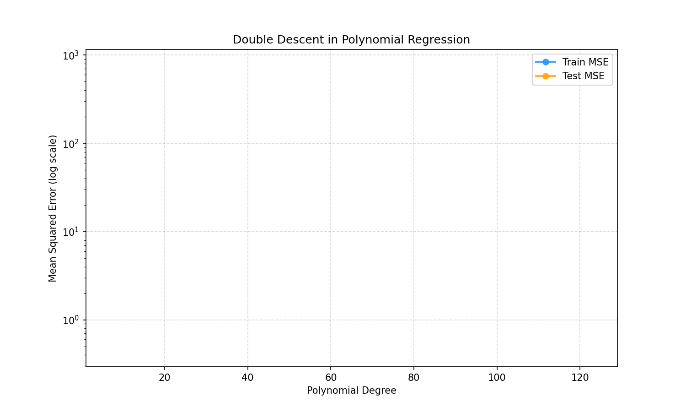

# PCA & Elastic Net VS Double Descent
<!--
***Provide a description of your project including*** 

1. motivating your research question
2. stating your research question
3. explaining your method and implementation
4. Briefly mention and discuss your results
5. Draw your conclusions
6. State what future investigations could be conducted
7. State your references 

### Further Guidance: Formating
- Structure this readme using subsections
- Your job is to 
    - keep it clear
    - provide sufficient detail, so what you did is understandable to the reader. This way other researchers and future cohorts of BeyondAI will be able to build on your research
    - List all your references at the end
- utilise markdown like *italics*, **bold**, numbered and unnumbered lists to make your document easier to read
- if you refer to links use the respective markdown for links, e.g. `[ThinkingBeyond](https://thinkingbeyond.education/)`
- If you have graphs and pictures you want to embed in your file use ``
- If you want to present your results in a table use
    | Header 1            | Header 2  |
    |---------------------|-----------|
    | Lorem Ipsum         | 12345     |

**Tip:** Use tools to create markdown tables. For example, Obsidian has a table plugin, that makes creating tables much easier than doing it by hand.
-->


## Overview

This project examines the impact of Principal Component Analysis (PCA) and Elastic Net regularization on the double descent phenomenon in high-dimensional polynomial regression. Double descent appears when model complexity approaches the interpolation threshold, causing test error to spike before decreasing again in the overparameterized regime.

We evaluate how PCA (with different variance-retention thresholds) and Elastic Net (with varying L1 ratios) reshape or suppress this behavior in polynomial regression trained on a controlled synthetic dataset.

- ### Double Descent
  A phenomenon in machine learning where test error first decreases, then increases near the interpolation threshold, and finally decreases again as model complexity continues to grow, showing a non-monotonic relationship between complexity and generalization.
  
- ### PCA (principal component analysis)
  A dimensionality reduction technique that transforms correlated features into a smaller set of uncorrelated variables (principal components) while retaining most of the original data’s variance. It helps simplify models and reduce noise.
  
- ### Elastic Net
  A regularization method that penalizes model combining both L1 (Lasso) and L2 (Ridge) penalties. It performs better on datasets with correlated features and it is considered more robust than using either methods alone.
  
## Research Question

### How do PCA and Elastic Net regularization affect the emergence, severity, and shape of the double descent curve in high-dimensional polynomial regression models?
We study whether these techniques suppress the interpolation spike, smooth the curve, or fundamentally alter model behavior.

## Motivation

Understanding the double descent phenomenon is crucial for developing robust machine learning models, particularly in high-dimensional settings where overparameterization is common, making it a compelling research topic. By investigating the effects of PCA and Elastic Net regularization, we aim to uncover strategies that mitigate excessive test error near the interpolation threshold. This knowledge can help practitioners design models that are both expressive and generalizable, especially when working with noisy or highly correlated features.

## Methodology
### Dataset
- a synthetic dataset generated
    - 100 samples
    - train/test split 80/20
    - input feature is $X \sim U [-1,\,1]$
      
$$
y = \sin(2\pi X) + \epsilon,\quad \epsilon \sim \mathcal{N}(0,\,1)
$$

### Model
- a polynomial regression model with degrees 1 -> 129 , fitted using Ridge regression with minimal regularization.
### Techniques
- PCA (Principal Component Analysis)
    - applied to the polynomial feature matrix to reduce the number of features based on the retained variance
    - Variance: 95% -> 100% 
- Elastic Net
    - applied to polynomial regression to regularize the model and reduce the noise
    - l1_ratio: 0.2-0.9
- Evaluation Metric: MSE ( mean square error )

 $$
\mathrm{MSE} = \frac{1}{n} \sum_{i=1}^{n} (y_i - \hat{y}_i)^2
$$
### Program Language : PYTHON => 3.12.12
### Libraries 
- NumPy => 2.0.2
- Scikit-Learn => 3.10.0
- Matplotlib => 1.6.1

Key ideas

- Compare polynomial regression (baseline) across increasing model complexity.
- Use PCA to control effective dimensionality before fitting a regressor.
- Use Elastic Net (with/without CV) to study the effect of L1/L2 regularization on double-descent.

Repository structure

```
├── README.md
├── requirements.txt
├── .gitignore
├── src/
│   ├── base_model.py              # polynomial regression model
│   ├── pca_model.py               # PCA + model 
│   └──elastic_net_model.py       # Elastic Net 
│    
├── figures/                       # (all output plots here)

```

Quick start (PowerShell)

1. Create and activate a virtual environment:

```powershell
python -m venv venv; .\venv\Scripts\Activate.ps1
```

2. Install dependencies:

```powershell
pip install -r requirements.txt
```

3. Run the built-in sanity checks for each module (from project root):

```powershell
python src\base_model.py
python src\pca_model.py
python src\elastic_net_model.py
```

If everything is installed correctly, each script should generate a graph in the Figures folder.


Development notes

- `requirements.txt` lists the core Python packages used for reproducible environments.
- `src/` modules include small `__main__` checks so you can quickly verify the pipeline works locally.

Contributing

Suggestions and pull requests welcome.

Contact

For questions or help, open an issue or contact the repository owner.

